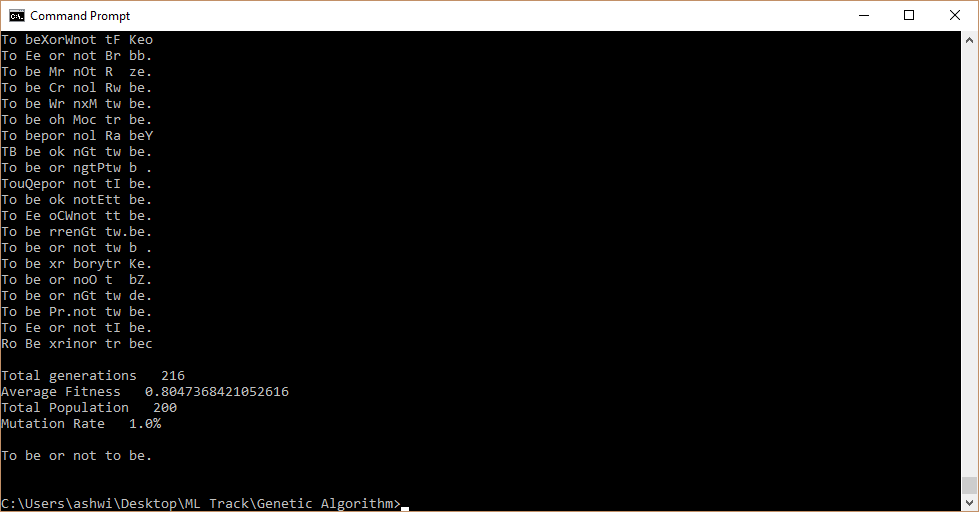

# GeneticAlgorithm-Strings
String generator using genetic algorithm

This is a Python port of genetic algorithm code from Daniel Shiffman's [Tutorial](https://www.youtube.com/watch?v=9zfeTw-uFCw).

[Original Code](https://github.com/shiffman/The-Nature-of-Code-Examples-p5.js/tree/master/chp09_ga/NOC_9_01_GA_Shakespeare)

## Screenshot

---

## License
Code released under MIT License

---
Written by [Ashwin Vaidya](www.twitter.com/ashwinvaidya17)